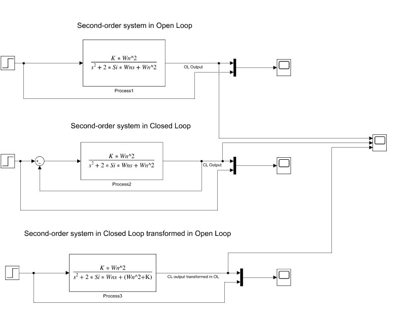

# First-Order and Second-Order Systems in Simulink

This lesson provides a detailed exploration of the behavior of First and Second-Order Systems in both Open and Closed Loop configurations, with a focus on systems with and without transport delays.

## First-Order Systems

Explore the fundamental characteristics of First-Order Systems, highlighting their response dynamics in both open and closed-loop settings.

## First-Order Systems with Transport Delay

Understand how transport delays influence the performance of First-Order Systems, and how these delays can be modeled and analyzed in Simulink.

## Second-Order Systems

Examine the complex dynamics of Second-Order Systems, focusing on their responses under different damping conditions and how these systems behave in open and closed-loop configurations.

## Second-Order Systems with Transport Delay

Learn about the impact of transport delays on Second-Order Systems and how these delays affect the system's stability and response time in Simulink.

