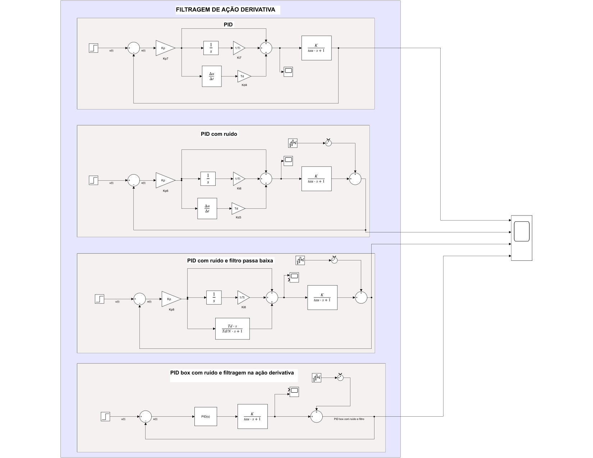

# Derivative Action Filtering in First-Order Processes with PID Controllers

Tune the PID controllers and compare the output responses of the circuits under white noise conditions, with and without derivative action filtering.

