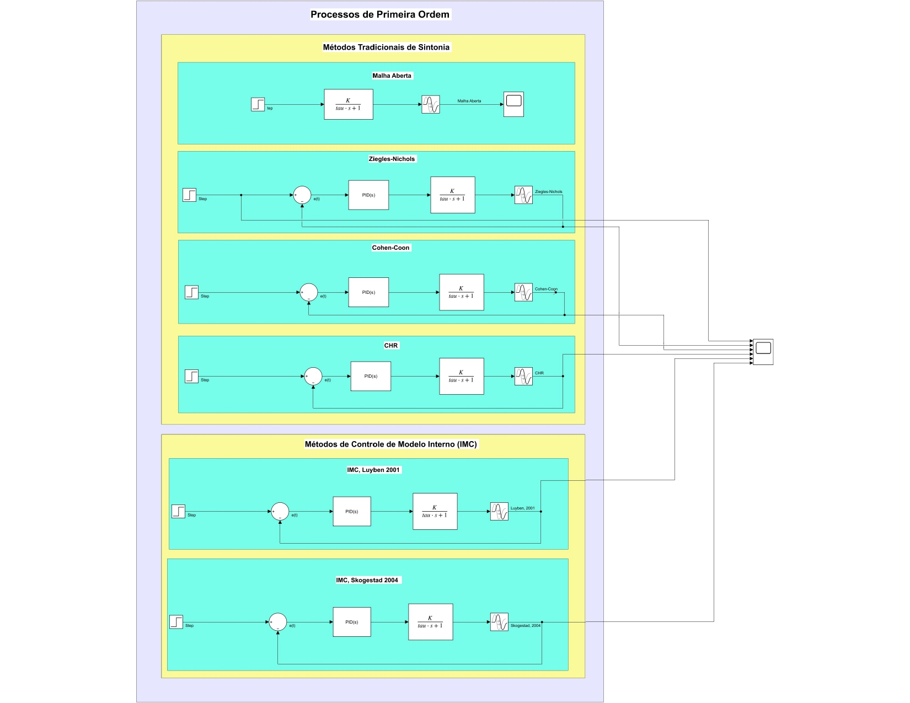
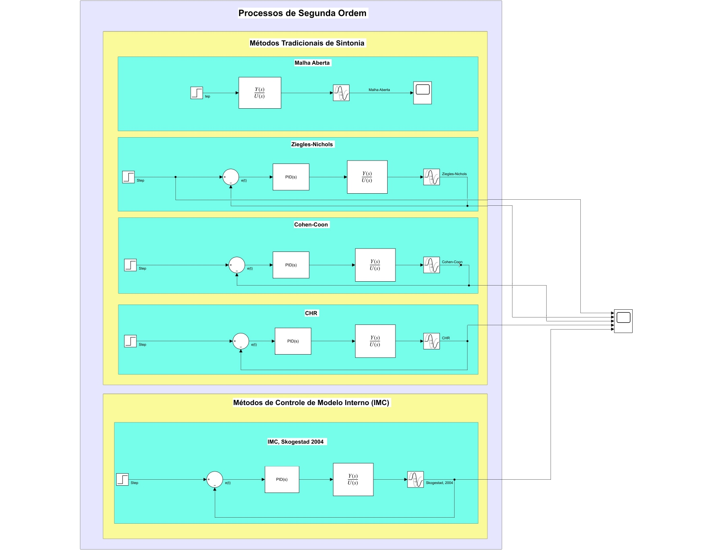

# Tuning Traditional and Internal Model Control (IMC) Methods for First and Second-Order Processes

Tune PID controllers for first and second-order processes in Simulink. When using traditional methods, ensure that the open-loop response of the process is sigmoidal before applying the Ziegler-Nichols (ZN), Cohen-Coon (CC), and Chien, Hrones, and Reswick (CHR) methods. Compare the controller outputs using different tuning methods.

## First-Order Processes

## Second-Order Processes

**Question:** Why is the Luyben (2001) method not used here?

