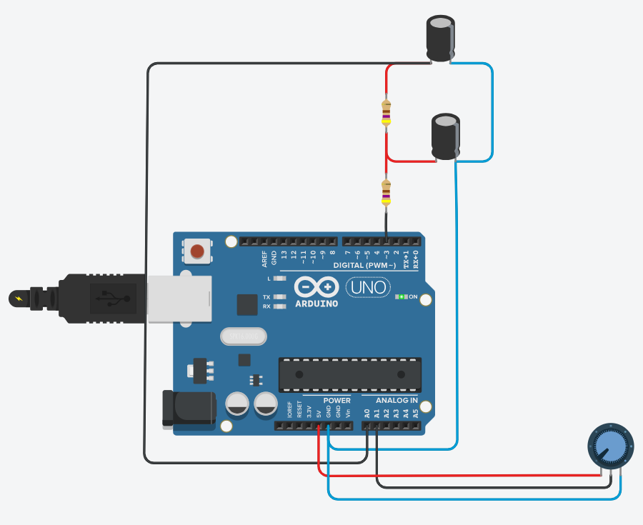
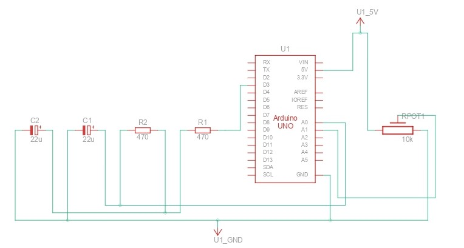

# Tuning a PWM-Based PID Controller on Arduino UNO

In this project, you will create a circuit using **two capacitors** and **two resistors** to implement a **PID controller** that controls the Arduino's PWM output. You can tune the system's output according to a **setpoint**, which can be either **fixed** or dynamically adjusted using a **potentiometer**.

### Breadboard Visualization of the PID Circuit on Arduino UNO

Below is the **breadboard view** showing how the components, including capacitors, resistors, and the potentiometer, are connected to the Arduino Uno:

### Schematic Diagram of the PID Circuit on Arduino UNO

The following image shows the **schematic view** of the circuit, which provides a clear understanding of the connections between the components:

### Steps to Implement:

1. **Circuit Setup**: 
   - Use the **breadboard** layout for physical connections, or refer to the **schematic** diagram for a deeper understanding of the circuit.
   - These components help to smooth out the PWM output and stabilize the response of the system. Optionally, connect a **potentiometer** to dynamically adjust the setpoint, allowing real-time tuning of the system.

2. **Code Upload**:
   - Use the **Arduino IDE** to upload the code to the **Arduino Uno's flash memory**. The code implements a basic PID controller where you can adjust the **Kp**, **Ki**, and **Kd** values to fine-tune the system's response.
   
3. **Observe the System**:
   - Open the **Arduino IDE's Serial Plotter** to visualize how the system behaves in real time. Adjust the **PID variables** and the **delay** in the `loop()` function to see how the response changes.
   
4. **Download the Code**:
   - You can download the code from this [link](./pid_controller_arduino_uno/pid_controller_arduino_uno.ino).

### Tuning the PID Controller:
- Adjust the **`Kp` (proportional)** to control how much the output responds to the error.
- Modify **`Ki` (integral)** to account for accumulated errors over time.
- Fine-tune **`Kd` (derivative)** to counteract quick changes in error, stabilizing the response.

By experimenting with these parameters and observing the response in the **Serial Plotter**, you can fine-tune your control system for optimal performance.

