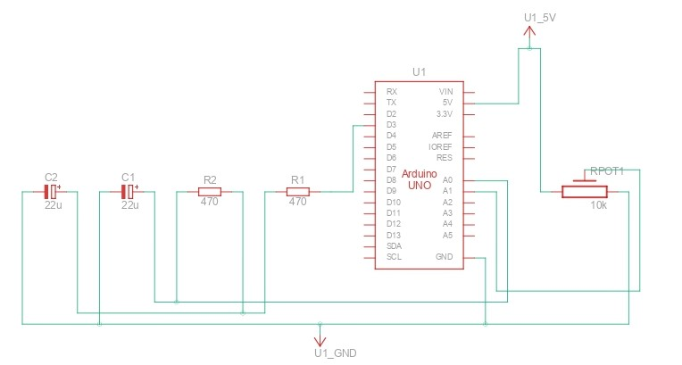

# PID Controller on Arduino UNO

Create the following circuit with two capacitors and two resistors. It is possible to tune the Arduino's PWM output according to the setpoint. You can use either a fixed setpoint or a variable one by using a potentiometer.

[With this code](./pid_controller_arduino_uno/pid_controller_arduino_uno.ino), upload it to the Arduino Uno's flash memory using the Arduino IDE platform. Observe how the system behaves by using the Arduino IDE's Serial Plotter, adjusting the PID controller variables, as well as the delay in the loop() function.

