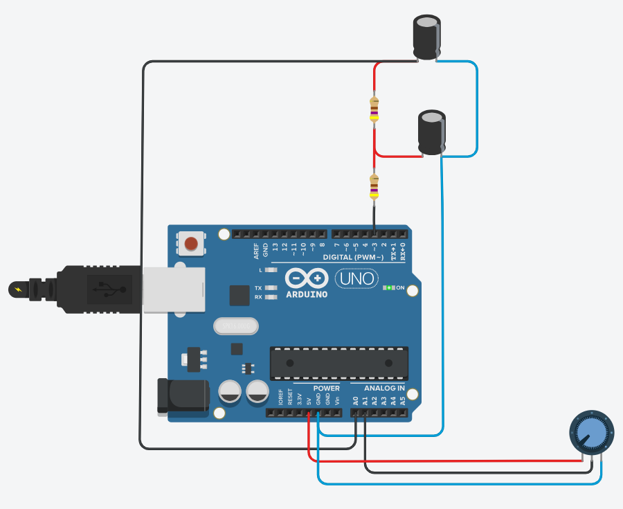
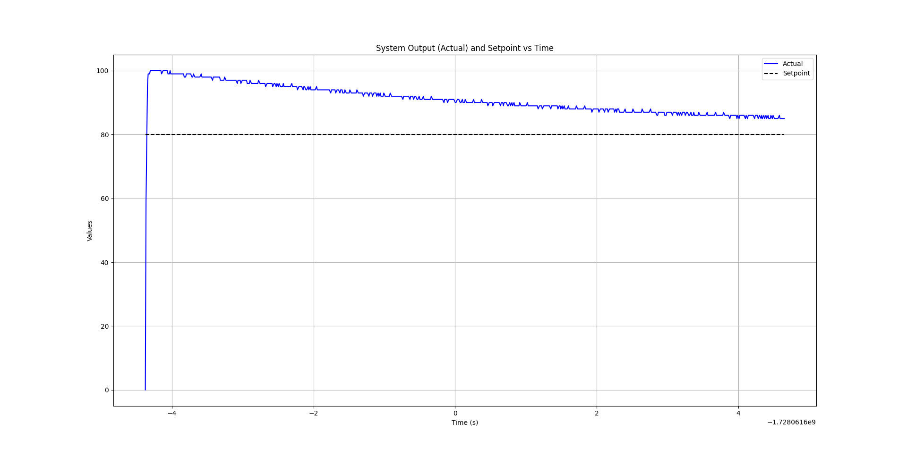

# Tuning a PWM-Based PID Controller with Derivative Filter, Anti-Windup, and Setpoint Weighting Techniques on Arduino UNO

## Build the Electrical Circuit on a Breadboard and Upload the Provided Code to the Arduino UNO

Building on the circuit from [Week 09](../../week_09/sources/), this project allows you to practice implementing a PID controller on an Arduino UNO, incorporating advanced control techniques such as **Derivative Filtering**, **Anti-Windup**, and **Setpoint Weighting**.

By using the [provided code](./pid_controller_filter_antiwindup_setpointweighting/pid_controller_filter_antiwindup_setpointweighting.ino), you can experiment with these features to fine-tune the performance of the controller.

## Monitor the Arduino Serial Output to Observe the PID Controller with Advanced Techniques

Once you've uploaded the code to the Arduino's flash memory, use the [provided Python script](./pid_controller_arduino_uno_serial_read/pid_controller_arduino_uno_serial_read.py) to monitor the output from the Arduino's serial interface. This will allow you to observe how the PID controller behaves in real time and analyze the effects of **derivative filtering**, **anti-windup**, and **setpoint weighting** on the system's performance.

**You can also modify the Python script to use other libraries, such as `PyQtGraph`, for improved real-time data visualization beyond the capabilities of `matplotlib`. This can provide a smoother, more responsive observation experience.**

**Modifications:**
Based on [Matheus Lima's code](https://github.com/matheuslimam/Atividade_CPI/blob/main/Atividades/realTimeSerial.py), now it is possible to have a smoother real time visualization on Arduino UNO PID Serial Output [here](./pid_control_arduino_uno_serial_read_real_time/). 

## What is the Electrical Circuit's Mathematical Model?

Refer to the [provided circuit](../../week_09/sources/) to determine its mathematical model. Use this model to tune the PID controller on the Arduino using the **Skogestad, 2004** method. Update the [PID controller code](./pid_controller_filter_antiwindup_setpointweighting/pid_controller_filter_antiwindup_setpointweighting.ino) to include the tuning formula based on your calculations.

