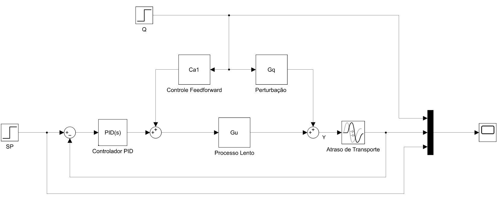
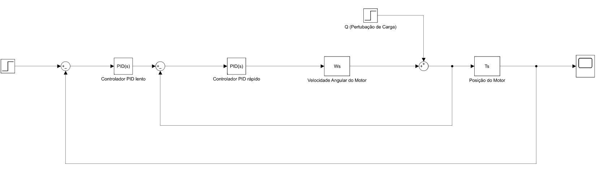

# **Feedforward and Cascade Control in Simulink**

## **Part 1: Feedforward Control**
- **System**: Temperature control of a water tank.
- **Disturbance**: Variation in the input water temperature.
- **Simulation**: Apply feedforward control to compensate for the disturbance before it affects the output.
- **Expected Outcome**: Improved temperature stability with feedforward control.

---

## **Part 2: Cascade Control with Load Motor**
- **System**: Position control of a load motor using a cascade controller.
- **Controllers**: Primary (Position) and secondary (Angular Velocity).
- **Simulation**: Observe how the angular velocity control loop stabilizes the motor's position response.
- **Expected Outcome**: Improved disturbance rejection and greater precision in controlling the motor's velocity.

---

## **Reflection Questions**:
1. How does feedforward control impact the stability of the water heater?
2. What is the effect of cascade control on the motor's response?

